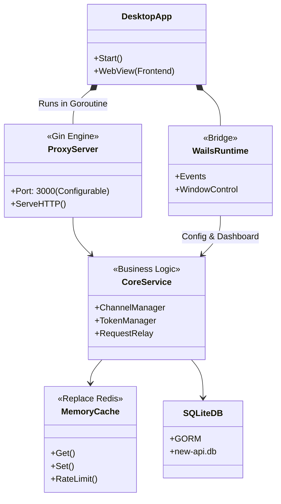

这是一个非常具有挑战性且富有商业价值的技术重构任务。将 `new-api`（One-API 的主要分支）从服务端架构迁移到桌面端 GUI，核心难点在于**去除重型依赖（如 Docker、Redis）**，并将**多租户服务端的逻辑转化为单用户桌面端的体验**。

# **构建方案、架构设计与落地路线**

---

### 1. 技术栈选型：Wails + Go + SQLite

既然明确了 **Golang** 和 **SQLite**，且需要构建 **桌面 GUI**，目前的最佳选择是 **Wails**。

* **GUI 框架：[Wails**](https://wails.io/)
* **理由**：Wails 是 Go 语言生态中的 "Electron"，但更轻量。它使用系统的原生 WebView（Windows 上是 WebView2，Mac 上是 WebKit），后端完全是 Go。
* **优势**：可以直接复用 `new-api` 现有的 Go 业务逻辑，同时可以直接复用 `new-api` 现有的 React 前端代码（只需少量修改）。


* **数据库：SQLite (via GORM)**
* `new-api` 本身已经支持 SQLite。我们需要做的是移除 MySQL/PG 的支持代码，锁定使用 SQLite，并确保数据库文件存储在用户的 `AppData` 或 `~/.config` 目录下。


* **缓存/状态管理：Go `sync.Map` / `go-cache` (替代 Redis)**
* **关键点**：`new-api` 严重依赖 Redis 做限流、验证码存储和分布式锁。桌面版是单实例运行，不需要分布式锁。我们需要重写一个兼容层，用内存缓存（Memory Cache）替换掉 Redis 调用。


---

### 2. 架构设计：双进程模型（伪）

虽然编译出来是一个二进制文件，但在逻辑上我们需要将其分为两个部分运行：

#### 逻辑架构图 (Mermaid ClassDiagram)



#### 架构核心解析

1. **宿主程序 (Main Routine)**：
* 启动 Wails 应用程序生命周期。
* 初始化 SQLite 数据库。
* **关键步骤**：启动一个 Goroutine 运行 `new-api` 原有的 Gin HTTP Server。
* **原因**：桌面端依然需要提供类似 `http://localhost:3000/v1/chat/completions` 的标准接口供第三方软件（Chatbox, LangChain 等）调用。单纯的 Wails IPC 绑定无法满足外部调用需求。


2. **去 Redis 化 (De-Redis)**：
* 构建一个 `CommonCache` 接口。
* 在 `common` 包中，将原有调用 `redis.RDB` 的代码重构。
* 使用 `patrickmn/go-cache` 或简单的 `sync.Map` 实现内存缓存。
* **限流 (Rate Limit)**：桌面端通常是单人使用，限流策略可以大幅简化，甚至默认关闭，或者基于内存计数器实现。


3. **前后端通信 (Interaction)**：
* **配置管理**：前端 React 页面通过 Wails JS SDK 调用 Go 方法来添加渠道、查看日志、设置端口。
* **数据展示**：仪表盘数据直接通过 SQL 查询返回给前端。


---

### 3. 重构实施方案 (Chain of Thought)

我们需要将 `new-api` 的服务端代码“降维”打击成桌面端代码。

#### 步骤一：环境与依赖剥离 (The "Slimming" Phase)

* **Docker 移除**：删除所有 Dockerfile, docker-compose。
* **Redis 剥离**：
* 搜索代码中所有 `common.RedisEnabled` 判断。
* 创建一个 `memory_store.go`，实现 `Get`, `Set`, `Del`。
* 修改 `common/redis.go`，如果是桌面模式（构建标签或配置），则初始化 MemoryStore 而不是 Redis 连接。
* 重点处理：`monitor` (监控), `rate-limit` (限流)。桌面版建议直接砍掉复杂的分布式监控，只保留本地日志。


#### 步骤二：嵌入 Gin Server (The "Integration" Phase)

* 在 Wails 的 `OnStartup` 生命周期回调中：
1. 执行数据库自动迁移（Auto Migrate）。
2. 读取本地配置文件（`config.json` 或 SQLite 配置表）。
3. **启动 Gin Server**：
```go
// 伪代码
go func() {
    router := gin.New()
    // 挂载原有 new-api 的路由
    router.POST("/v1/chat/completions", controller.Relay)
    // ... 绑定端口
    router.Run(":3000")
}()

```


* 确保端口冲突检测，如果 3000 被占用，提示用户修改。

#### 步骤三：前端迁移与改造 (The "GUI" Phase)

* 将 `new-api/web` 目录下的 React 代码移动到 Wails 的 `frontend` 目录。
* **路由改造**：原本的前端是 SPA（单页应用），依赖 Nginx 或 Gin 的静态文件服务。在 Wails 中，构建后的静态资源由 Wails 内部协议（`wails://`）服务。
* **API 调用改造**：
* `new-api` 前端大量使用 `axios` 请求 `/api/xxx`。
* **方案 A (推荐)**：保持 Gin Server 运行，将前端的 `baseURL` 指向 `http://localhost:3000`。这样改动最小，前端几乎不用动。
* **方案 B (深度集成)**：将 `/api/xxx` 的请求封装成 Wails Go 方法，前端改为调用 `window.go.main.App.GetStatus()`。这种方式性能更好，但重构工作量巨大。
* *建议采用方案 A，但在登录鉴权上做特殊处理，桌面端默认是“管理员”身份，取消登录页，打开即由 LocalStorage 注入一个永不过期的 Root Token。*


#### 步骤四：渠道模块的两种类型实现 (深化设计)

我们的核心愿景是**解决用户的“本地 Token 焦虑”**。
通过**Gateway（网关）**模式，Novapi 不仅是 API 的转发器，更是用户本地算力与权限的聚合器。
我们将渠道分为**在线渠道**和**本地渠道**，特别是**本地渠道**，需要做到极致的自动发现与异构集成。

1. **在线渠道 (Upstream/Proxy)**：
* **定义**：传统的 API Key 转发模式。
* **现状**：`new-api` 已完善支持 OpenAI, Azure, Claude, Gemini 等。
* **策略**：保留原样，提供简洁的配置界面。

2. **本地渠道 (Local/Native) —— 核心差异化竞争力**：
* **痛点**：用户手头有各种零散的算力（Ollama）、各种工具自带的 AI 权限（GitHub Copilot CLI, AWS Q CLI），但无法统一调度，导致“Token 焦虑”。
* **解决方案**：Novapi 作为一个**通用适配器（Universal Adapter）**，将这些异构资源转化为标准的 OpenAI 接口。

* **A. 进程级自动发现与托管 (Service Discovery & Managed Process)**
    * **端口扫描**：自动检测 `localhost` 的常见端口（如 11434 Ollama, 1234 LM Studio, 8080 Llama.cpp），发现即由用户确认添加为渠道。
    * **进程托管**：对于 `llama.cpp` 或 `ollama` 二进制文件，Novapi 可作为父进程直接启动它们，管理生命周期（启动、停止、日志监控），让用户无需手动敲命令行。

* **B. CLI/Plugin 异构集成 (CLI Adapter)**
    * **设计思路**：许多开发者工具（Code-CLI）如 `gh` (GitHub CLI), `aliyun-cli` 等已包含 AI 能力。Novapi 将通过**标准输入输出流 (stdio)** 封装这些 CLI，将其伪装成 OpenAI 接口。
    * **场景举例**：
        * **GitHub Copilot**：检测用户是否安装 `gh` 且已登录 Copilot。Novapi 后台调用 `gh copilot suggest ...` 并解析返回结果，对外提供 Chat 接口。
        * **Company CLIs**：企业内部常有自带鉴权的 CLI 工具。Novapi 允许用户配置简单的“命令模板”，将其接入网关。
    * **价值**：极大降低用户成本，复用已有的工具权限。

* **C. 插件环境嗅探 (Plugin Environment Sniffing)**
    * **VSCode/JetBrains 插件**：扫描常见 IDE 插件目录，识别已安装的 LLM 插件（如 Continue, CodeGeeX）。
    * **配置提取**：尝试读取这些插件的配置文件（通常是 JSON/XML），提取出用户已配置好的 Model Endpoint 或 API Key，实现“一键迁移配置”到 Novapi。

3. **Gateway 的终极形态**：
* 对外暴露统一的 `http://localhost:3000`。
* 用户的所有应用（Chatbox, 终端, IDE）只需指向这个地址。
* Novapi 在后台智能路由：
    * 简单问题 -> 路由给本地 Ollama (免费)。
    * 复杂编程问题 -> 路由给 CLI Adapter (GitHub Copilot)。
    * 极难推理问题 -> 路由给在线 GPT-4 (付费)。


---

### 4. 产品落地与功能裁剪

为了让产品更像一个“桌面工具”而不是“本地服务器”，需要进行大刀阔斧的裁剪：

| 功能模块 | 服务端 (new-api) | 桌面端 (New-Desktop) | 处理策略 |
| --- | --- | --- | --- |
| **用户系统** | 多租户、注册、登录、邀请码 | **单用户 (Admin)** | 移除登录页，启动即由系统生成并自动填入 Master Key。保留“令牌”管理用于给外部应用鉴权。 |
| **充值/支付** | Stripe, 易支付 | **移除** | 桌面版是自用的，不需要支付模块。 |
| **日志系统** | 数据库日志，量大 | **精简日志** | SQLite 存储，增加“一键清理”和“保留最近7天”的自动维护策略。 |
| **监控** | Uptime Kuma 集成 | **简化** | 仅在仪表盘显示当前并发数和请求成功率。 |
| **设置** | 环境变量大量配置 | **UI 配置化** | 所有原本通过 ENV 配置的项（如超时时间、屏蔽词），改为设置页面中的表单项，存入 SQLite `options` 表。 |

### 5. 核心代码结构调整示例

**文件：`main.go` (Wails 入口)**

```go
package main

import (
	"embed"
	"new-api-desktop/backend" // 原 new-api 的核心逻辑被封装在此
	"github.com/wailsapp/wails/v2"
	"github.com/wailsapp/wails/v2/pkg/options"
)

//go:embed all:frontend/dist
var assets embed.FS

func main() {
	// 1. 初始化数据库 (SQLite)
	backend.InitDB("new-api.db")
    
	// 2. 初始化去 Redis 化的内存缓存
	backend.InitMemoryCache()

	app := NewApp()

	// 3. 启动后台 API 代理服务 (Gin)
	go backend.StartGinServer(":3000")

	err := wails.Run(&options.App{
		Title:  "New API Desktop",
		Width:  1024,
		Height: 768,
		Assets: assets,
		OnStartup: app.startup,
		Bind: []interface{}{
			app,
		},
	})

	if err != nil {
		println("Error:", err.Error())
	}
}

```

### 6. 总结

要实现的愿景：

1. **核心复用**：`new-api` 的 `relay` 和 `model` 包是核心资产，可以直接复用。
2. **关键剥离**：Redis 必须死。使用 `go-cache` 或 `sync.Map` 在内存中模拟 Redis 的操作接口。
3. **形态转换**：使用 **Wails** 包裹，前端沿用 React。
4. **体验优化**：砍掉多租户和支付系统，改为单机 Admin 模式。增加“本地进程管理”功能，使其能像 `Antigravity-Manager` 一样管理本地模型进程，并自动注册为渠道。

这个方案不仅技术上可行（Go 生态的完整性），而且能极大复用现有代码，是最快落地的路径。
